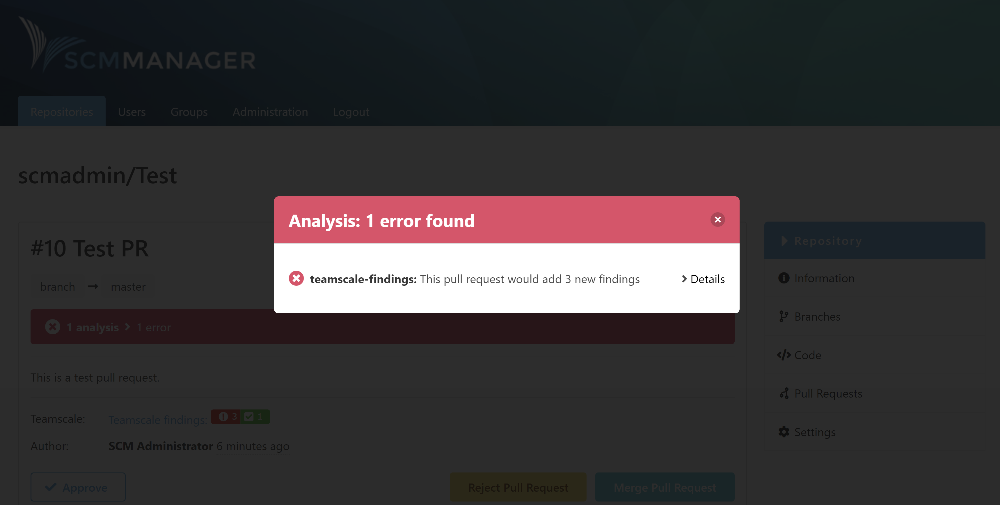
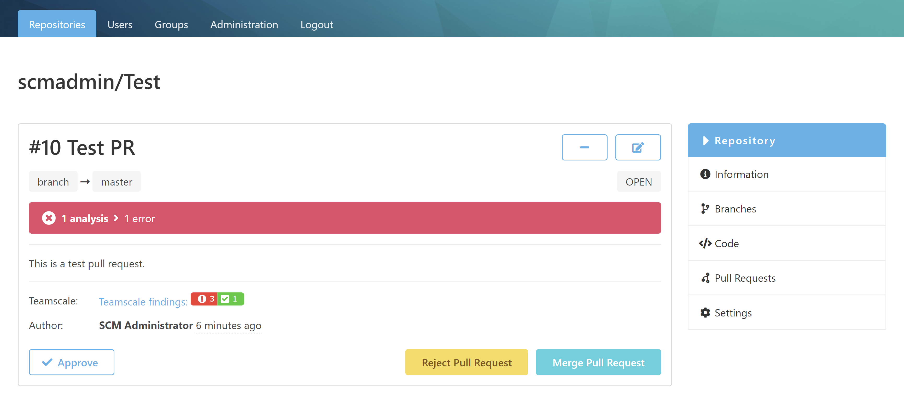
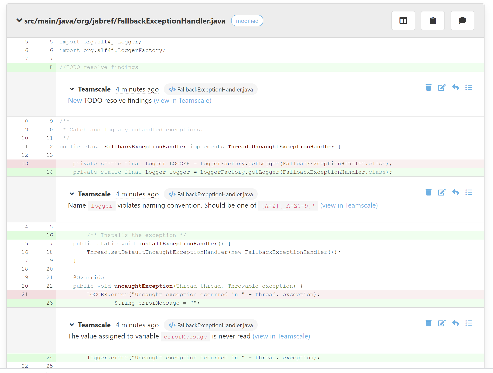

Nachdem Teamscale vom SCM-Manager über Änderungen informiert wurde, wird eine statische Code-Analyse durchgeführt. Die Ergebnisse dieser Analyse werden zurück an den SCM-Manager gesendet.

Es wird ein genereller Status von Teamscale anhand der Analyse Ergebnisse über das [SCM-CI-Plugin](https://www.scm-manager.org/plugins/scm-ci-plugin/) am Pull Request angezeigt.

Zusätzlich gibt es noch direkt am Pull Request einen Findings Badge (Ergebnisplakette), welcher einen Überblick über die Art der Findings liefert.
Dabei gibt es je nach Teamscale Konfiguration beispielsweise "kritisch", "moderat" und "niedrig". Ebenso kann angezeigt werden, ob Findings behoben wurden.

Für die Findings erzeugt Teamscale zeilenbasierte Kommentare direkt in der Diff Ansicht eines Pull Requests. Damit können Pull Request Autoren und Reviewer besser auf die Findings eingehen.

