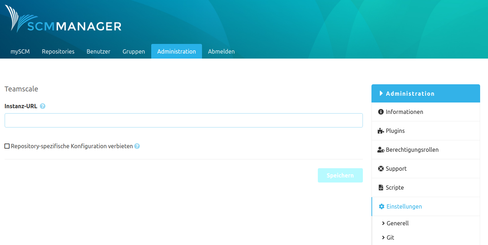

Zum Konfigurieren von Teamscale wird lediglich die URL einer Teamscale Instanz benötigt. 
Mithilfe dieser URL werden Informationen über die Repositories an Teamscale übermittelt und somit statische Code-Analysen gestartet. 
Die Analyse-Ergebnisse werden dann direkt an den Commits oder Pull Requests angezeigt.

Es gibt die Möglichkeit eine Teamscale Instanz über die globale Konfiguration anzubinden. Weiterhin ist es aber auch möglich pro Repository eine eigene Teamscale Instanz-URL einzutragen. 
Die Option der repository-spezifischen Konfiguration kann über die globale Konfiguration deaktiviert werden.

Bei einer validen Konfiguration wird Teamscale bei folgenden Events innerhalb der SCM-Manager benachrichtigt:

- `Repository Push`: Es wurden Änderungen auf ein Repository gepusht.
- `Pull Request erstellt`: Ein neuer Pull Request innerhalb des SCM-Managers wurde erstellt.
- `Pull Request geändert`: Ein Pull Request wurde verändert. 

