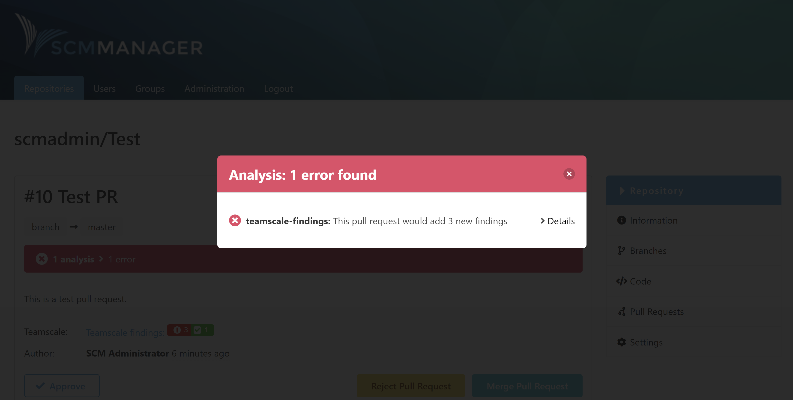
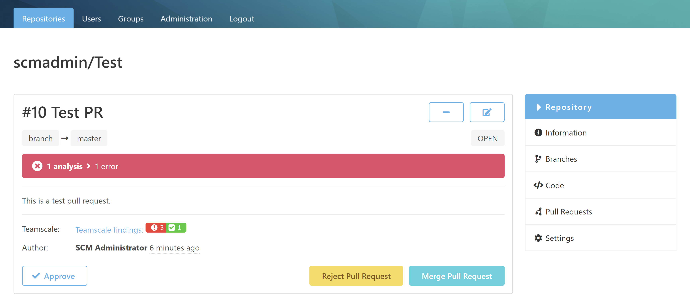
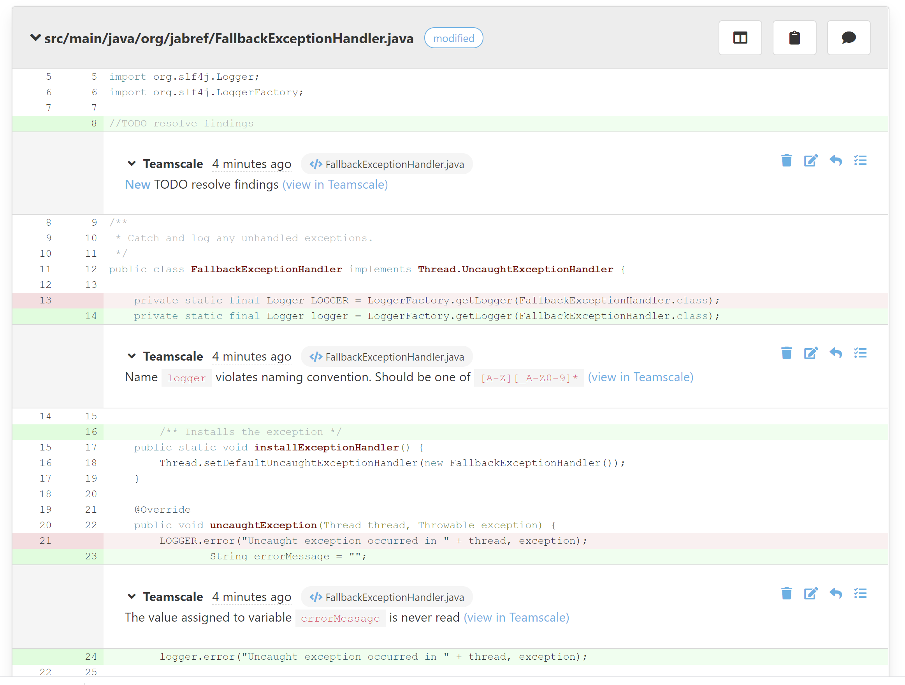

After Teamscale was notified by the SCM-Manager about changes for repositories or pull requests, a static code analysis is carried out. Afterwards the analysis report is returned to SCM-Manager.

The general analysis report status is shown in the statusbar using the [SCM-CI-Plugin](https://www.scm-manager.org/plugins/scm-ci-plugin/).

Additionally a findings badge is shown on the pull request which provides some more information about the kind of Teamscale findings. 
There may be findings like "critical", "moderate" or "low" depending on the Teamscale rules configured. Also the removed findings are shown by the badge.

Teamscale creates line-based comments for the findings in the diff view of the pull request. This way the pull request author and reviewers can better react to Teamscale findings. 

