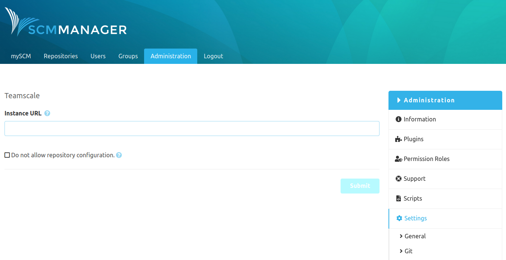

For the Teamscale configuration in SCM-Manager only the Teamscale instance url is required. 
Through this url SCM-Manager will inform Teamscale about events regarding repositories and pull requests and afterwards will receive analysis reports from Teamscale.
The analysis results will be shown directly at the commits or as well pull requests.

The Teamscale configuration can be set for all repositories using the global configuration. 
Also it is possible to configure Teamscale for each repository individually. 
The repository-specific configuration can be turned off at the global configuration.

If Teamscale was configured successfully the SCM-Manager will notify Teamscale about following events:

- `Repository Push`: One or more changes were pushed to the repository.
- `Pull Request created`: A new pull requests in SCM-Manager was created.
- `Pull Request changed`: An existing pull requests was changed.

